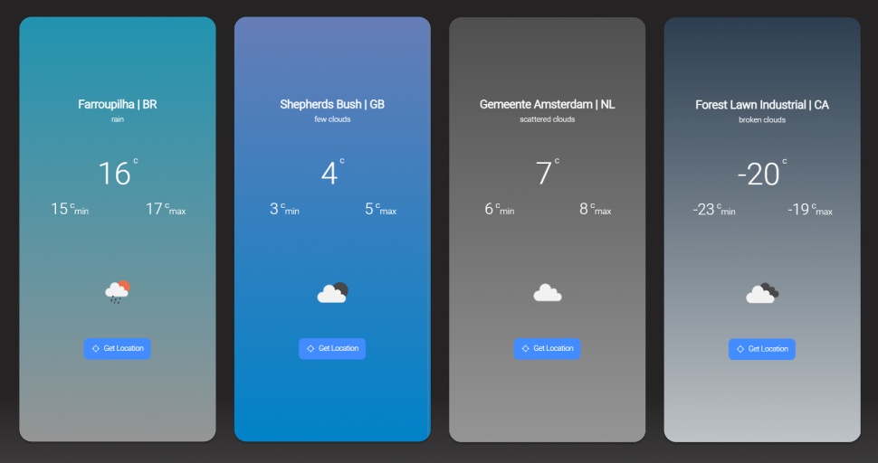

# [Weather App](https://github.com/fabriciovo/ionic-weather-app/)
A local weather app that fetches weather forecast from Openweathermap.org. A  Web App built with React and Ionic.

## Features
* Get weather of current location
* Different theme depending on time
* Different weather icon depending on weather

## Built With
* React
* Ionic
* Typescript

## App
* Github Page: https://fabriciovo.github.io/ionic-weather-app/
* Download APK: --

## Credits

- [Fabricio Varisco Oliveira](https://github.com/fabriciovo)

